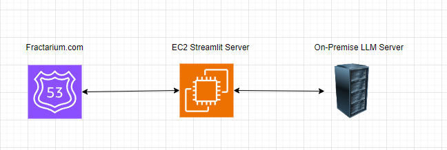

# 허세진 챗봇 이력서

## 경량화 목적

- 기존 gpt-4o-mini 모델 API 이용 금액과 AWS 비용이 부담됨
- On-Premise에 로컬 llm을 경량화시켜 배포

## 경량화 & 최적화

- EXAONE 모델을 경량화시켜 학습(추론) 속도 향상
- 8비트 양자화 적용
- 모델을 미리 로드해두고 API가 호출 될 때 마다 추론만 실행
- 성과
    - 텍스트 생성 성능 개선 (20분 이상 -> 3분(최대))

## 비용 최적화

- 모델 변경: gpt-4o-mini → EXAONE-3.0-7.8B-Instruct
- On-Premise에서 LLM API 서버, EC2에서 Streamlit 서버 실행
- 성과
    - Free-Tier 에서 구동 성공
    - 서버 비용 절감(18.391$ → 0.503$)

## 코드

- Streamlit Server
    
    ```python
    import streamlit as st
    import requests
    
    FASTAPI_URL = "http://hsj3925.iptime.org:8000/query"
    
    st.title("Bot")
    
    if "messages" not in st.session_state:
    	st.session_state.messages = []
    
    for m in st.session_state["messages"]:
    	with st.chat_message(m["role"]):
    		st.markdown(m["content"])
    		
    if user_msg := st.chat_input("What is up?"):
    	with st.chat_message("user"):
    		st.markdown(user_msg)
    		user_prompt = user_msg
    
    	st.session_state.messages.append({"role": "user", "content": user_msg})
    
    	with st.chat_message("assistant"):
    		# FastAPI 서버에 요청 보내기
    		response = requests.post(FASTAPI_URL, json={"query": user_prompt})
    		if response.status_code == 200:
    			result = response.json().get("answer", "응답을 가져오는 데 실패했습니다.")
    		else:
    			result = "FastAPI 서버 요청이 실패했습니다."
    
    		st.markdown(result)
    		
    	st.session_state.messages.append({
    		"role": "assistant", 
    		"content": result
    	})
    ```
    
- LLM Server
    
    ```python
    from fastapi import FastAPI, Query
    from pydantic import BaseModel
    from transformers import AutoModelForCausalLM, AutoTokenizer, AutoModel
    import faiss
    import torch
    import os
    import requests
    from bs4 import BeautifulSoup
    import numpy as np
    
    # FastAPI 인스턴스 생성
    app = FastAPI()
    
    # 환경 변수 설정
    os.environ['KMP_DUPLICATE_LIB_OK'] = 'True'
    
    # 웹 페이지 크롤링 함수
    def crawl_specific_class(url):
        response = requests.get(url)
        soup = BeautifulSoup(response.content, 'html.parser')
        specific_content = soup.find(class_="page__inner-wrap")
        return specific_content.get_text(strip=True) if specific_content else "지정된 클래스를 찾을 수 없습니다."
    
    # 임베딩을 위한 모델 및 토크나이저 로드
    embedding_model_name = "sentence-transformers/all-MiniLM-L6-v2"
    tokenizer = AutoTokenizer.from_pretrained(embedding_model_name)
    embedding_model = AutoModel.from_pretrained(embedding_model_name)
    
    # 임베딩 함수 정의
    def get_embeddings(texts):
        inputs = tokenizer(texts, padding=True, truncation=True, return_tensors="pt")
        with torch.no_grad():
            embeddings = embedding_model(**inputs).last_hidden_state.mean(dim=1)
        return embeddings.numpy()
    
    # 텍스트 벡터화 및 FAISS 인덱스 생성
    url = "https://dehkartes.github.io/blog/resume/"
    crawled_text = crawl_specific_class(url)
    sentences = crawled_text.split(". ")
    embeddings = get_embeddings(sentences)
    
    d = embeddings.shape[1]
    index = faiss.IndexFlatL2(d)
    index.add(embeddings)
    
    # 텍스트 생성 모델 (EXAONE) 로드
    model_name = "LGAI-EXAONE/EXAONE-3.0-7.8B-Instruct"
    generation_tokenizer = AutoTokenizer.from_pretrained(model_name)
    generation_model = AutoModelForCausalLM.from_pretrained(
        model_name,
        load_in_8bit=True,
        trust_remote_code=True,
        device_map="auto"
    )
    
    # Pydantic 모델 정의
    class QueryRequest(BaseModel):
        query: str
    
    # RAG 파이프라인 함수
    def retrieve_and_generate(query, top_k=5):
        query_embedding = get_embeddings([query])
        distances, indices = index.search(query_embedding, top_k)
        retrieved_texts = [sentences[i] for i in indices[0]]
        
        prompt = (
            "이력서 내용을 기반으로 질문에 간단히 답해라 "
            "\n이력서 내용: " + " ".join(retrieved_texts) + "\n질문: " + query
        )
        
        inputs = generation_tokenizer(prompt, return_tensors="pt").to("cuda")
        output = generation_model.generate(
            **inputs, max_length=2000, max_new_tokens=500, temperature=0.7
        )
        generated_text = generation_tokenizer.decode(output[0], skip_special_tokens=True)
        answer = generated_text[len(prompt):].strip()
        
        return answer
    
    # API 엔드포인트 정의
    @app.post("/query")
    async def query_endpoint(request: QueryRequest):
        result = retrieve_and_generate(request.query)
        return {"answer": result}
    ```
    

## 아키텍처



## 서비스

